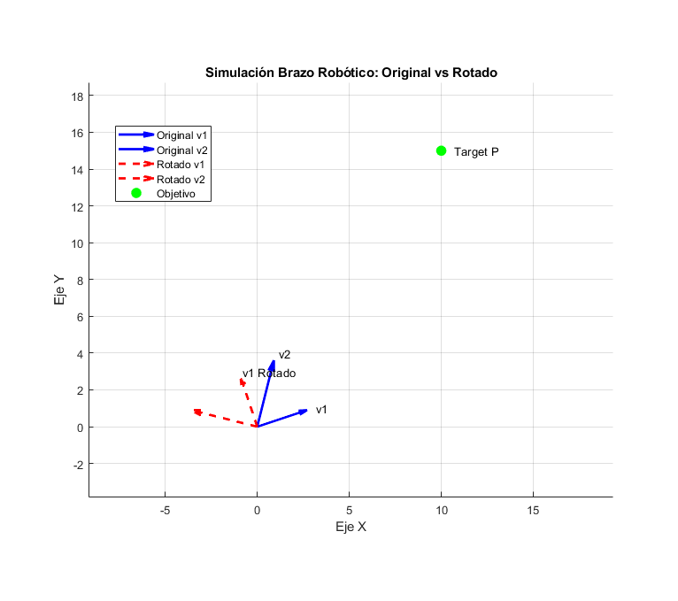

# UNEMI-TI-C4-AL-CP2
Algebra Lineal - Componente Practico 2

# Simulación y Control de Brazo Robótico en 2D 🤖📐

Este proyecto presenta un caso práctico integral desarrollado en **MATLAB**, diseñado para demostrar la aplicación de los conceptos fundamentales del **Álgebra Lineal** en el campo de las Tecnologías de la Información.

El script simula el comportamiento cinemático de un brazo robótico de dos segmentos, resolviendo problemas de posicionamiento, validación de movimiento y rotación automatizada mediante operaciones matriciales.

## 📋 Descripción del Caso

El código modela un brazo robótico compuesto por dos vectores en un espacio bidimensional ($\mathbb{R}^2$). El objetivo es utilizar herramientas matemáticas para:
1. Definir la estructura del robot.
2. Determinar si el robot puede alcanzar un punto específico en el espacio (Targeting).
3. Analizar si la configuración mecánica es válida (evitar singularidades).
4. Aplicar transformaciones de movimiento (Rotación) de forma automática.

## 🎓 Relación con el Sílabo (UNEMI)

Este proyecto integra las 4 unidades académicas de la asignatura de Álgebra Lineal:

### ✅ Unidad 1: Sistemas de Ecuaciones Lineales y Matrices
* **Aplicación:** Se modela el robot como una matriz $A$ compuesta por vectores columna.
* **Resolución:** Se utiliza la ecuación matricial $Ax = b$ y la matriz inversa ($A^{-1}$) para calcular los escalares necesarios (cinemática inversa) para que el robot alcance un punto objetivo $P$.

### ✅ Unidad 2: Determinantes
* **Aplicación:** Cálculo del determinante (`det(A)`).
* **Análisis:** Se utiliza para verificar la **Independencia Lineal**. Si el determinante es diferente de 0, aseguramos que el robot tiene libertad de movimiento completa en el plano y no ha colapsado en una sola línea (singularidad).

### ✅ Unidad 3: Espacios Vectoriales
* **Aplicación:** Definición de los segmentos del brazo como vectores en $\mathbb{R}^n$ (específicamente $\mathbb{R}^2$).
* **Conceptos:** Uso de combinaciones lineales y bases para generar el movimiento.

### ✅ Unidad 4: Transformaciones Lineales
* **Aplicación:** Implementación de una **Matriz de Rotación** $T$ para girar el robot 90 grados.
* **Análisis Avanzado:** Cálculo del **Kernel (Núcleo)** y el **Rango** de la transformación para demostrar teóricamente que la rotación conserva las dimensiones del objeto y no pierde información.

## 🚀 Requisitos

* **Software:** MATLAB (Cualquier versión reciente).
* **Toolboxes:** No se requieren toolboxes adicionales (usa funciones nativas de álgebra lineal).

## ⚙️ Instalación y Ejecución

1.  Clona este repositorio:
    ```bash
    git clone [https://github.com/TU_USUARIO/TU_REPOSITORIO.git](https://github.com/TU_USUARIO/TU_REPOSITORIO.git)
    ```
2.  Abre MATLAB y navega hasta la carpeta del proyecto.
3.  Ejecuta el archivo principal:
    ```matlab
    caso_algebra_final
    ```

## 📊 Resultados Esperados


Al ejecutar el script, obtendrás:
1.  **Salida en Consola:** Un análisis paso a paso mostrando los vectores, el valor del determinante, la solución del sistema de ecuaciones y el análisis del Kernel/Rango.
2.  **Gráfico:** Una ventana de figura (`figure`) que visualiza:
    * Los vectores originales (posición inicial en Azul).
    * Los vectores transformados (posición rotada en Rojo).
    * El punto objetivo (Target) que el robot intenta alcanzar.

## 👤 Autor

**Leonardo Lopez**
* Carrera: Tecnologías de la Información (En Línea)
* Institución: Universidad Estatal de Milagro (UNEMI)
* Asignatura: Álgebra Lineal - Primer Nivel

---
*Este proyecto fue desarrollado como parte de la evaluación final de la asignatura.*
